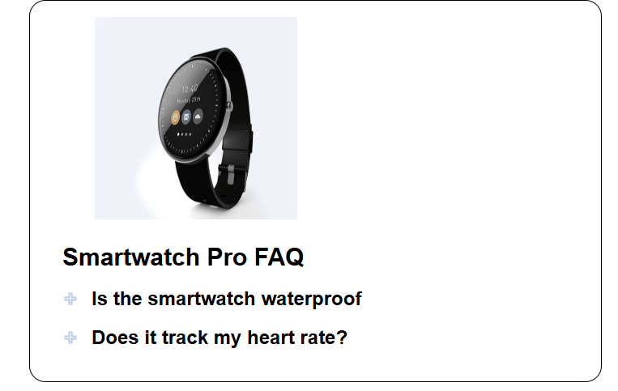
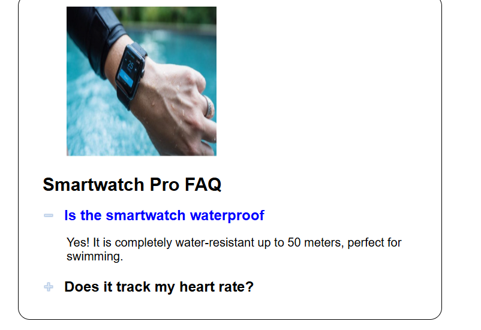
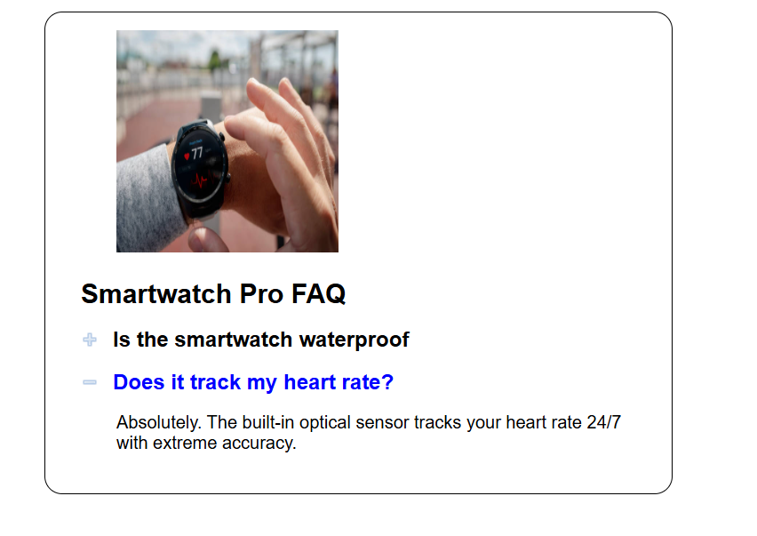

# Smartwatch FAQ's

<b>Table of Contents</b>
- [Summary](#summary)
- [New Concepts](#new-concepts)
- [ScreenShots](#screenshots)
  - [Main Page](#main-page)
  - [Waterproof](#water-proof)
  - [Heart Rate](#heart-rate)
- [Maintainers](#maintainers)
--------------------------------------

## Summary
This FAQ and Image Swap is to create a Smartwatch Pro FAQ
page. It displays the correct image
based on the question selected, or it resets to the default image when all
questions are closed.

-------------------------

## New Concepts

- Get Attributes
- Control Elements
- Preload Images
- nextElementSibling
- src & alts

--------------------
## Screenshots

------------------------------------

### Main Page

---------------------------------
### Water Proof

----------------------------------
### Heart Rate

------------------------------------
## Maintainers
[@tarath01](https://github.com/tarath01) Taylor Rath  

-----------------------------
[Back to the Top](#smartwatch-faqs)
